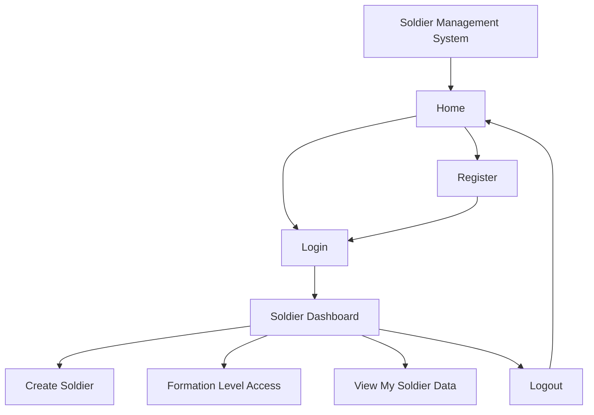
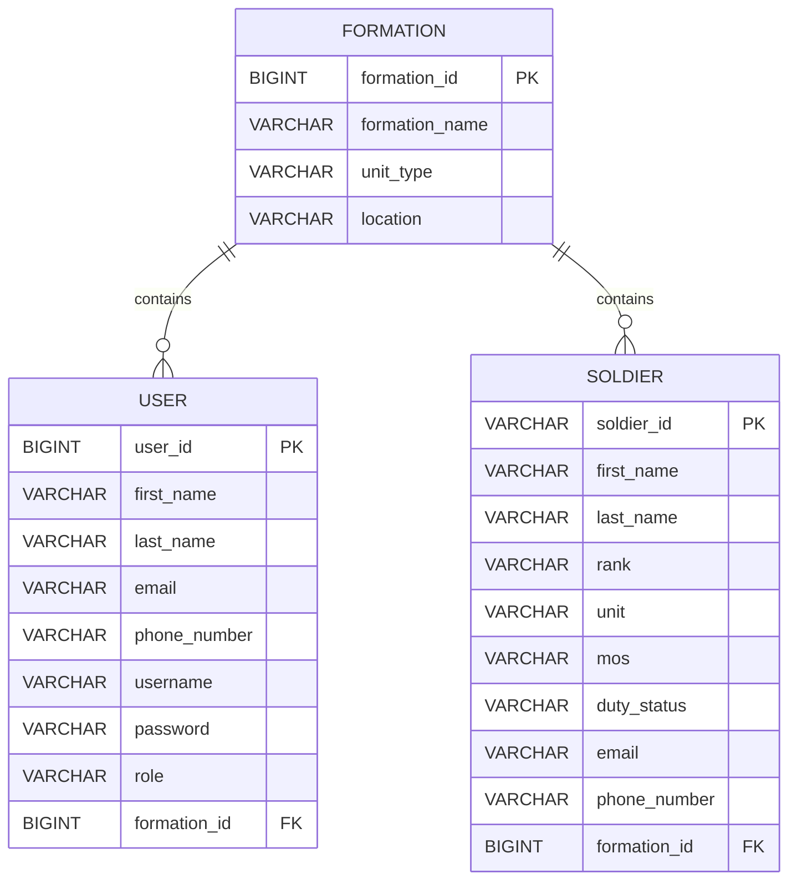
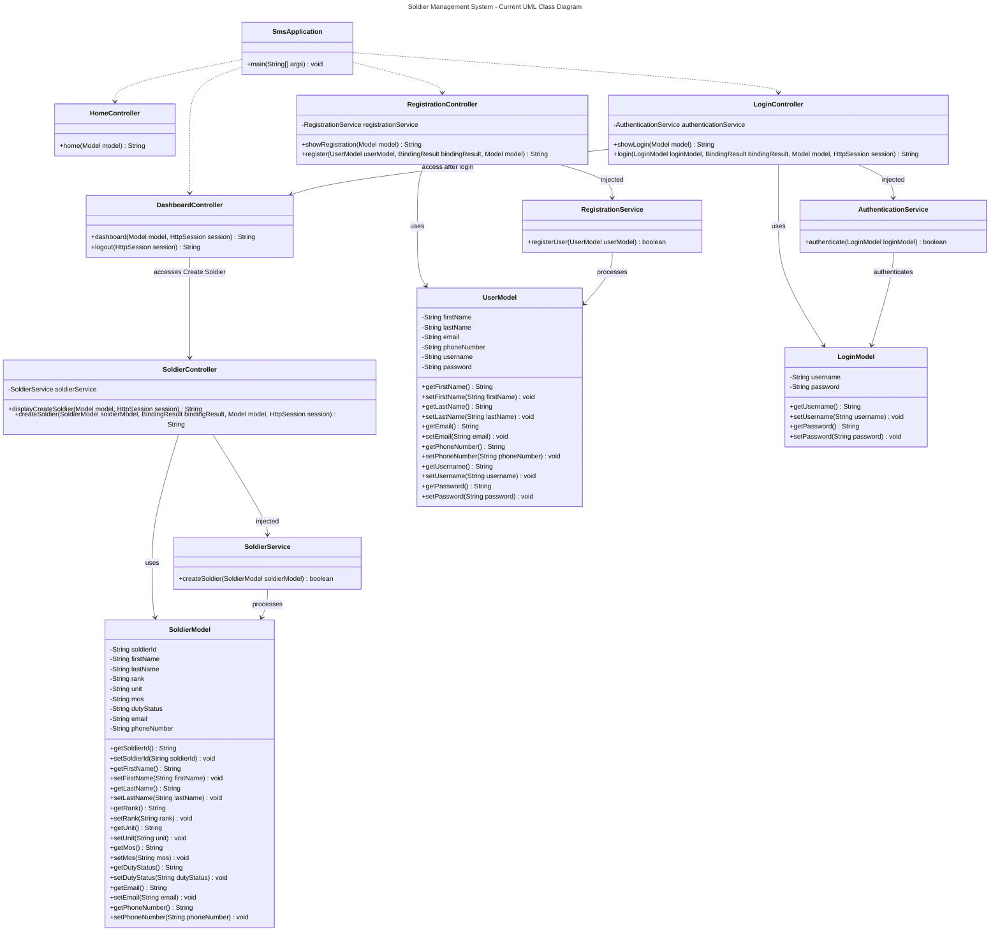

# CST-339 Programming in Java III

## Introduction

Grand Canyon University’s Programming in Java III (CST-339) is designed for building web applications of enterprises using the Java programming language and the Spring framework. Various components of the project include object-oriented programming, Spring Boot, Spring MVC, Thymeleaf, Spring Core, dependency injection, validation, responsive web design, database design, and others enterprise application development principles.

 My milestone course project is the **Soldier Management System (SMS)**. This application will be developed in stages within the course using the N-Layer architecture. The purpose of this application is to build a web-based Soldier information management application and at the later milestones, information management of formation-level personnel.

The current project includes user registration, simulation of user login, sessions, Soldier Dashboard, and Soldier Creation. Spring business services and dependency injection were used in order to separate business operations from the presentation layer.

Further, the project will be extended to cover database persistence, CRUD operations, Spring Security, REST services, and final application documentation.

### Technologies

The project currently uses:

- Java 17
- Spring Boot
- Spring MVC
- Spring Core
- Spring Beans
- Dependency Injection
- Thymeleaf
- Jakarta Bean Validation
- Bootstrap
- HTML
- CSS
- Maven
- Git
- GitHub
- Visual Studio Code
- Embedded Tomcat

Additional technologies will be introduced as the course project progresses, including relational database persistence, Spring JDBC or Spring Data JDBC, Spring Security, and REST services.

### Application Features

Through Milestone 3, the Soldier Management System includes:

- Responsive Home page
- User Registration page
- Registration form validation
- User Login page
- Login form validation
- Simulated authentication
- HTTP session management
- Authenticated Soldier Dashboard
- Create Soldier functionality
- Soldier form validation
- Spring-managed business services
- Constructor-based dependency injection
- Shared Thymeleaf page components
- Bootstrap responsive styling
- Consistent application theme
- Planned relational database design
- UML, architecture, sitemap, and ER design documentation

## Milestone Assignments

| Milestone | Description |
| --- | --- |
| [Milestone 1](https://github.com/DragonReborn10/cst339/blob/main/milestones/milestone1/README.md) | Established the initial design and project plan for the Soldier Management System. The milestone defined the application's purpose, requirements, proposed architecture, user interface concepts, sitemap, and initial technical design. |
| [Milestone 2](https://github.com/DragonReborn10/cst339/blob/main/milestones/milestone2/README.md) | Implemented the initial Spring MVC web application. The application introduced the Home, Registration, Login, and Dashboard pages using Spring MVC, Thymeleaf, Bootstrap, Jakarta Bean Validation, and a common application theme. Registration and login were implemented without database persistence. |
| [Milestone 3](https://github.com/DragonReborn10/cst339/blob/main/milestones/milestone3/README.md) | Expanded the application with Spring Beans, Spring Core, business services, and dependency injection. Registration and login were refactored to use business service classes, and the product creation requirement was implemented as Create Soldier. Soldier creation uses Spring MVC, Thymeleaf, Jakarta validation, and a Soldier business model. Create Soldier is accessed through the authenticated Dashboard. A relational database model was also designed in preparation for database implementation in the next milestone. |

> Additional milestone assignments will be added as they are completed.

## Course Project

### Soldier Management System

The **Soldier Management System (SMS)** is the primary application being developed throughout CST-339.

The application is designed to manage Soldier information within military formations. The project uses fictional test information during development and demonstration.

The current Soldier model includes:

- Soldier ID
- First Name
- Last Name
- Rank
- Unit
- MOS
- Duty Status
- Email
- Phone Number

The planned application design associates Soldiers and authorized users with formations. This design will support future functionality for viewing and managing personnel at the appropriate formation level.

### Current Navigation

The **Create Soldier** functionality is accessed through the Soldier Dashboard after login rather than being exposed as a top-level application option.

---

## Database Design

A relational database model has been designed in preparation for database implementation in a future milestone.

The planned database contains three primary entities:

- `FORMATION`
- `USER`
- `SOLDIER`

A Formation can contain multiple Users and multiple Soldiers.

The database design is currently a design artifact only. Database persistence will be implemented during a later course milestone.

## Current UML Class Diagram

## Project Progress

### Milestone 1

Milestone 1 focused primarily on project planning and system design. The Soldier Management System concept, application requirements, architecture, navigation, user interface concepts, and development plan were established.

### Milestone 2

Milestone 2 moved the development of the project from design phase to developing a Spring Boot web application. The use of Spring MVC, controllers, models, Thymeleaf, Bootstrap, registration, login, validation, and Soldier Dashboard were achieved.

Authentication was just simulated since database persistence and Spring Security were not included in Milestone 2.

### Milestone 3

In Milestone 3, we introduced a business service layer specifically for the business logic via Spring Beans with dependency injection. The Authentication and Registration process were refactored, and the logic was moved out from Spring MVC Controller.

For implementing the creation of products, we use the business domain of our application. This functionality is provided via SoldierModel, SoldierController, and SoldierService.

Create Soldier is accessible via authenticated Soldier Dashboard. For validating Soldier information that is submitted by users, Jakarta Bean Validation and `BindingResult` are utilized.

Tables and Relationships are developed for the Database, although database persistence will be done later in another milestone.

## Future Development

The Soldier Management System will continue to evolve throughout the remaining CST-339 milestones. Planned development includes:

- Relational database integration
- Spring JDBC or Spring Data JDBC
- Persistent user registration
- Persistent Soldier records
- Database-backed authentication
- View Soldier functionality
- Update Soldier functionality
- Delete Soldier functionality
- Formation-level Soldier management
- User roles and authorization
- Spring Security
- REST API services
- JavaDoc and final code documentation
- Final testing and application refinement

## Conclusion

The first three milestones of CST-339, the Soldier Management System has developed into a Spring Boot web application from its conceptual stages and application design.

The project has helped to gain experience in Java enterprise application development using Spring Boot, Spring MVC, Thymeleaf, Maven, Bootstrap, Jakarta Bean Validation, Spring Beans, Spring Core, and dependency injection. Currently, the application has separation of presentation and business logic in terms of controllers, models, and Spring-managed service classes.

In Milestone 2, the project had the main web interface, forms for registration and login, validation, page templates sharing, and Soldier Dashboard. In Milestone 3, the architecture of the project has been extended with the introduction of the business service layer and implementation of the Create Soldier workflow.

Currently, the project uses simulation of authentication and creation of non-persistent Soldiers since there is no database integration yet. The relational database structure has been designed in such a way that later milestones will be able to add persistent Users, Soldiers, and Formations to it without changing the purpose of the application itself.

The application will keep developing into a fully-fledged N-Layer enterprise application.