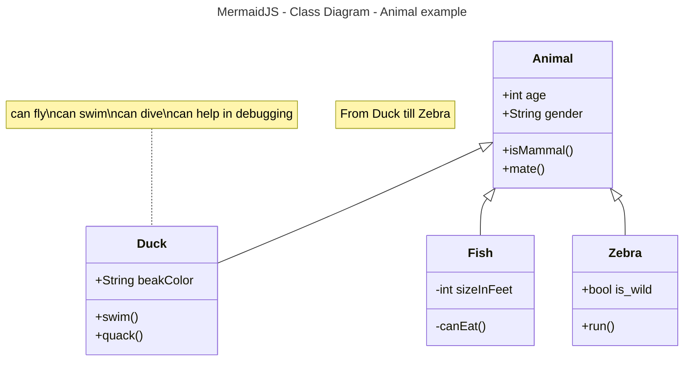

# Activity 1

- Author:  John Dearing
- Date:  09/08/2026

## Introduction

- This is **Activity 1** ...

## Fruit Ordered List
1. Oranges
2. Apples
     1. Red
     2. Yellow
     3. Green
4. Lines

## Fruit Un-ordered List
- Oranges
- Apples
     - Red
     - Yellow
     - Green
- Lines

## Links / Images

- [wikiBob](https://gitlab.com/bobby.estey/wikibob/-/blob/master/README.md)
- [Grand Canyon University](https://www.gcu.edu/)


## Tables
|First Name|Last Name|
|--|--|
|John|Dearing|
|Hannah|Dearing|

```java
// Java Example
public class CodeBlock {
    public static void main(String[] args) {
        System.out.println("Code Block Example");
    }
}
```



## Emoji
[Emoji Cheatsheet](https://github.com/ikatyang/emoji-cheat-sheet)

Cheers! :beers: