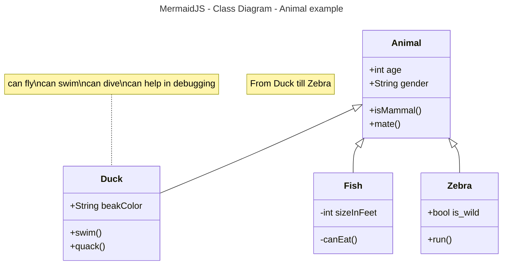

# Activity 1

- Author:  John Dearing
- Date:  09/12/2026

## Introduction

- This is **Activity 1: Tools Installation, Validation, and Learning Maven**

- The goal of this activity is to gain knowledge on the tools and techniques used in the development and deployment of Spring Boot application. This activity gives us the opportunity to practice and apply our knowledge on how to configure Spring Tool Suite, create and test a simple “Hello World” Spring Boot application, and ensure that our local development environment is functioning properly. This activity serves as an introduction to the use of Maven in creating a project and handling its dependencies. With the use of the POM file of Maven, creation of JAR file and executing the application will allow us to develop necessary skills for the future.

## Activity 1 file layout
1. activity1part1: Tools Installation and Validation
     1. src\main\java\com\gcu\activity1part1\Activity1part1Application.java (Spring Boot Hello World! java code)
     2. src\main\resources\static\index.html (localhost web Hello World!)
2. Activity 1-2: Learning Maven 
     1. Red
     2. Yellow
     3. Green

## Links / Images

- [wikiBob](https://gitlab.com/bobby.estey/wikibob/-/blob/master/README.md)
- [Grand Canyon University](https://www.gcu.edu/)


## Tables
|First Name|Last Name|
|--|--|
|John|Dearing|
|Hannah|Dearing|

```java
// Java Example
public class CodeBlock {
    public static void main(String[] args) {
        System.out.println("Code Block Example");
    }
}
```



## Emoji
[Emoji Cheatsheet](https://github.com/ikatyang/emoji-cheat-sheet)

Cheers! :beers: