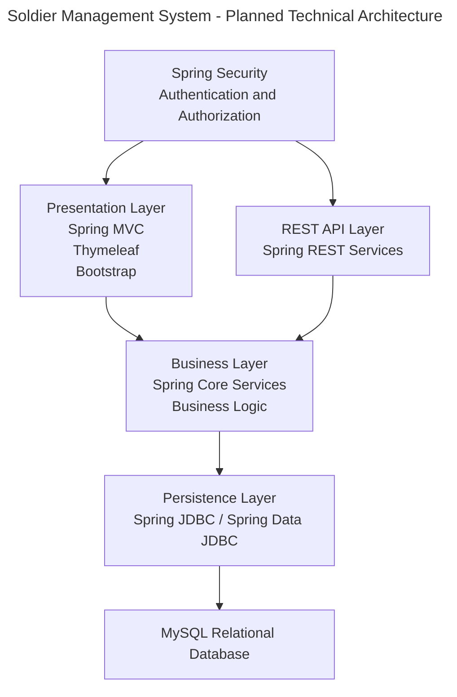
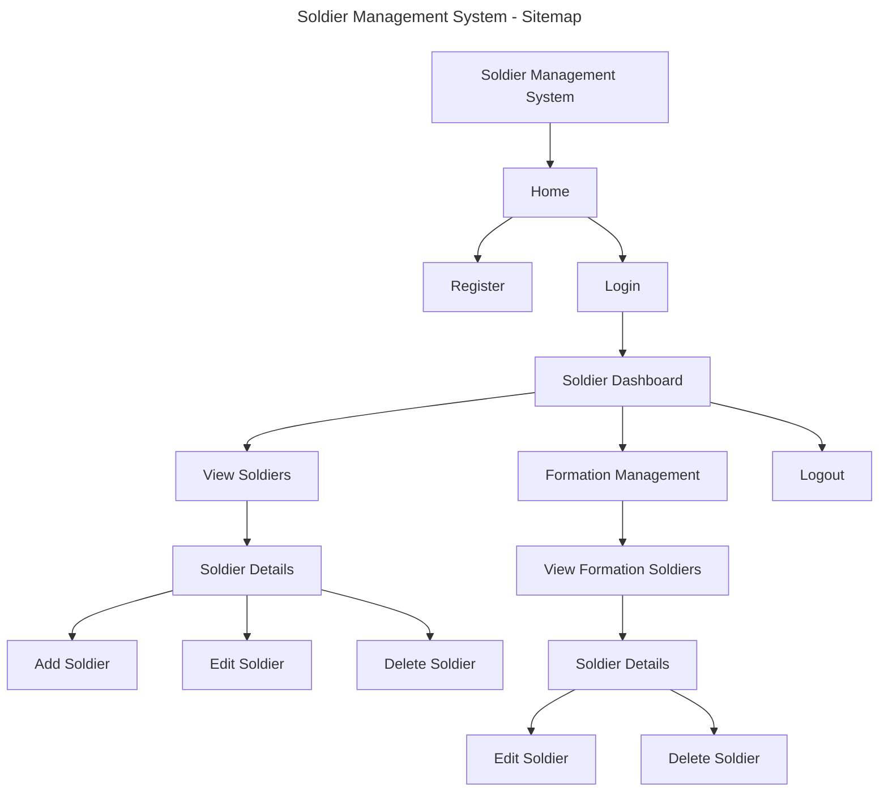
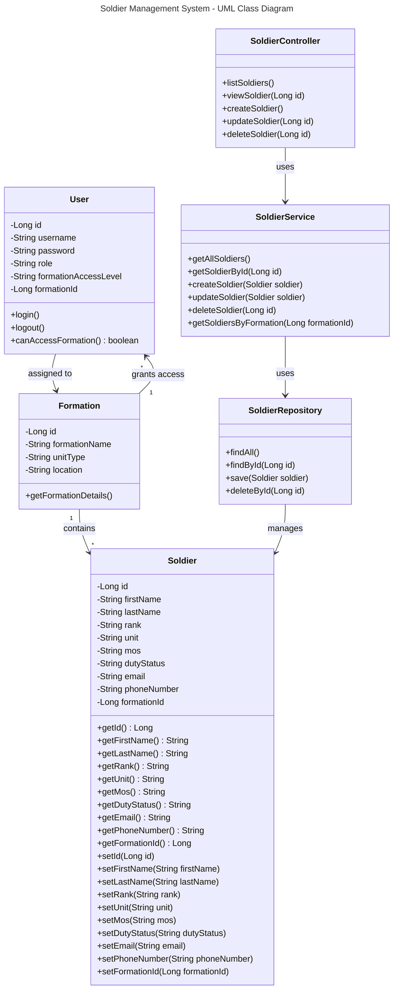

# Milestone 1

- Author:  John Dearing
- Date:  09/13/2026

## Introduction

- This is **Milestone 1: Tools Installation, Validation, and Learning Maven**

- The goal of this activity is to gain knowledge on the tools and techniques used in the development and deployment of Spring Boot application. This activity gives us the opportunity to practice and apply our knowledge on how to configure Spring Tool Suite, create and test a simple “Hello World” Spring Boot application, and ensure that our local development environment is functioning properly. This activity serves as an introduction to the use of Maven in creating a project and handling its dependencies. With the use of the POM file of Maven, creation of JAR file and executing the application will allow us to develop necessary skills for the future.

## Project Proposal

- My proposed project is a Soldier Management System (SMS). This application aims to offer a web-based solution for managing soldiers' information in which the authorized user can create, view, update, and delete soldier data.

- The main business entity of this application will be Soldier. Soldiers' data will consist of basic data, such as a soldier ID, first name, last name, rank, unit, Military Occupational Specialty (MOS), duty status, email, and phone number. Fake data will be used during implementation.

- This application will be designed as an enterprise N-Layer application using the Spring Boot framework. The presentation layer will be designed using Spring MVC and Thymeleaf to render web pages. The bootstrap technology will be utilized to design a responsive interface. As a further step when implementing subsequent milestones, business and persistence services will be developed separately so that business logic won't be implemented directly into MVC views/models/controllers.

## Project Objectives

- The major goal of the Soldier Management System is to show all concepts and technologies learned in CST-339 by using them in the personnel management domain.

- The final system will have to provide features for user registration/login, where users can then use their accounts to manipulate the soldier records. 

- The following operations need to be provided: 
The system will perform the required CRUD operations in its main business domain.
Other features like form validation, Bootstrap pages, database persistence, dependency injection, Spring Security, and REST APIs will be added in accordance with the future milestones.

## Proposed Soldier Data

|Field|Description|
|--|--|
|Soldier ID|Unique identifier for each soldier record|
|First Name|Soldier's first name|
|Last Name|Soldier's last name|
|Rank|Current military rank|
|Unit|Soldier's assigned unit|
|MOS|Military Occupational Specialty|
|Duty Status|Current duty status|
|Email|Contact email|
|Phone Number|Contact phone number|
|Formation Access Level|Defines the user's level of access within the organization. For example, a Company Commander or authorized full-time staff member can be granted access to view and manage all soldier records assigned to their company or formation.|

## Proposed Application Functionality

- The fully developed Soldier Management System is expected to consist of registration and login modules as well as the capability to manage soldier data. Once authenticated, the user will navigate to a soldier dashboard where he/she can either look at soldiers already stored in the database or CRUD operation on the soldier.

- This application will eventually have:
     - User registration and login
     - Soldier dashboard
     - View all soldiers
     - Add new soldier
     - View single soldier
     - Update soldier
     - Delete soldier
     - Form validation
     - Database persistence
     - Secured application pages
     - RESTful API to soldier data

## Division of Work

- This Soldier Management System project will be done by me individually. Thus, I will be accountable for all the project planning, designing, development, testing, documentation, and presentation processes.

- The processes I will be accountable for include Spring Boot project development and maintenance; Spring MVC Models, Views, and Controllers creation; Thymeleaf templates development; responsive Bootstrap interface implementation; Soldier business model designing; business and persistence layer development; database connectivity implementation; registration and login feature development; Spring Security implementation; REST API development; testing and debugging of the project; management of the project's Git repository; design reports and screencast development; JavaDocs generation; and project presentation.

- Since the project is done individually, I will also be accountable for the review and refactoring of my code at every milestone based on instructors' feedback.

## Planned Technical Architecture 

## Sitemap

## UML Class Diagram

## WireFrame

## Links

- [John Dearing CST339 Repository](https://github.com/DragonReborn10/cst339/tree/main)
- [Grand Canyon University](https://www.gcu.edu/)