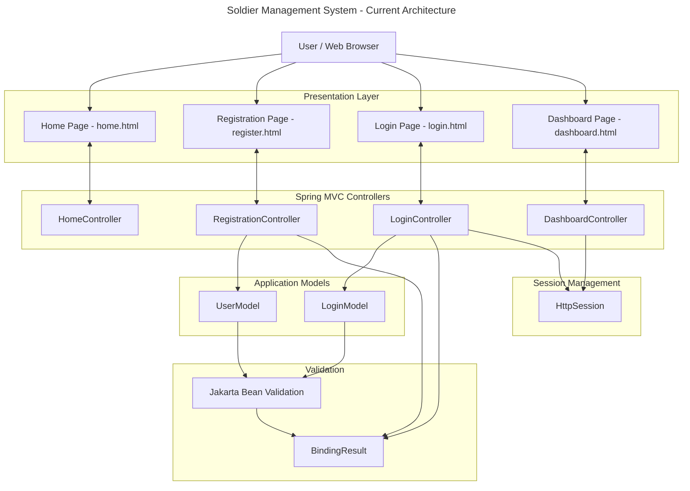
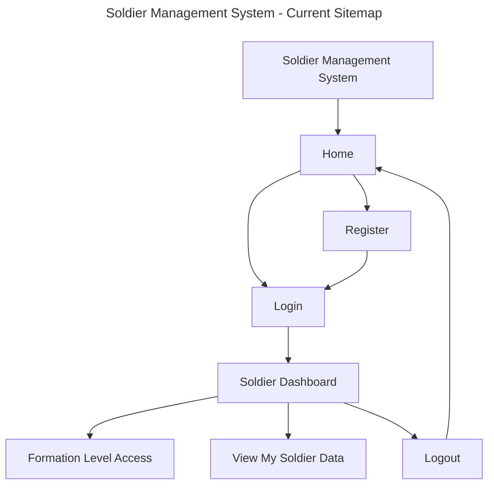
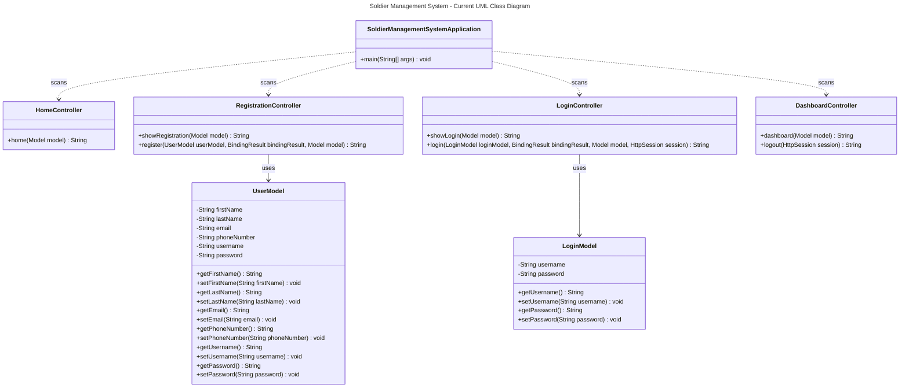

# Milestone 2

- Author: John Dearing
- Date: 09/20/2026

## Introduction

- This is **Milestone 2:**

- In Milestone 2, I have fulfilled the requirements of the project by designing and implementing the core components of the Soldier Management System with the help of Spring Boot, Spring MVC, Thymeleaf, and Bootstrap. I have used the techniques described in Activity 2 for building MVC controllers, models, binding user inputs through Thymeleaf forms and validating user data with Jakarta Bean validation @Valid and BindingResult tags. Header and footer fragments have been designed in defaultTemplate.html. The responsiveness of Home, Registration, Login, and Dashboard pages has been achieved using Bootstrap and custom CSS. The Registration and Login features have been developed without any database.

## Task Compleated

1. Developed the main Soldier Management System application using Spring Boot and Spring MVC.

2. Created the Home, Registration, Login, and Dashboard pages using Thymeleaf.

3. Created reusable header and footer fragments using defaultTemplate.html.

4. Implemented responsive page layouts using Bootstrap and custom CSS.

5. Created UserModel and LoginModel classes for registration and login data.

6. Implemented registration and login forms using Thymeleaf form binding.

7. Implemented Jakarta Bean Validation using @Valid, validation annotations, and BindingResult.

8. Added validation error messages to the Registration and Login pages.

9. Implemented simulated login functionality without a database.

10. Implemented navigation between the Home, Registration, Login, and Dashboard pages.

11. Created and updated the Current Architecture, Sitemap, and UML Class Diagrams.

12. Tested page navigation, form validation, responsive layouts, and application functionality.

## Known Issues

- Registration information is not currently saved to a database.
- Login authentication is simulated for Milestone 2.
- Forgot Username and Forgot Password functionality has not yet been implemented.
- Formation Level Access and View My Soldier Data are currently dashboard options but their full functionality will be implemented in later milestones.
- Full authentication and authorization will be implemented during a later security milestone.

## Current Architecture

## Current Sitemap

## Current UML Class Diagram

## Screenshots

- Login page - empty form:

- Login page - empty form with errors:

- Register page - empty form:

- Register page - empty form with errors:

- Home page:

- Dashboard page:

## Links

- [John Dearing CST339 Repository](https://github.com/DragonReborn10/cst339/tree/main)
- [Grand Canyon University](https://www.gcu.edu/)
