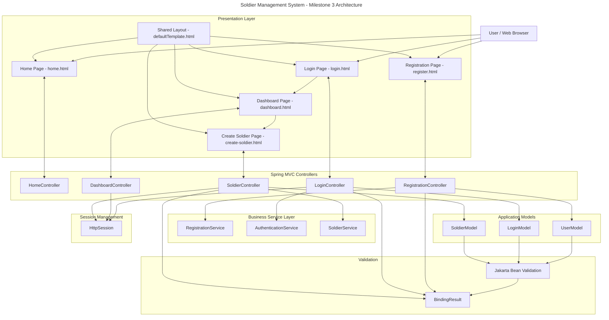
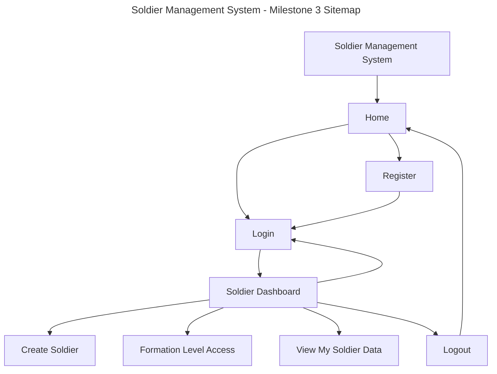
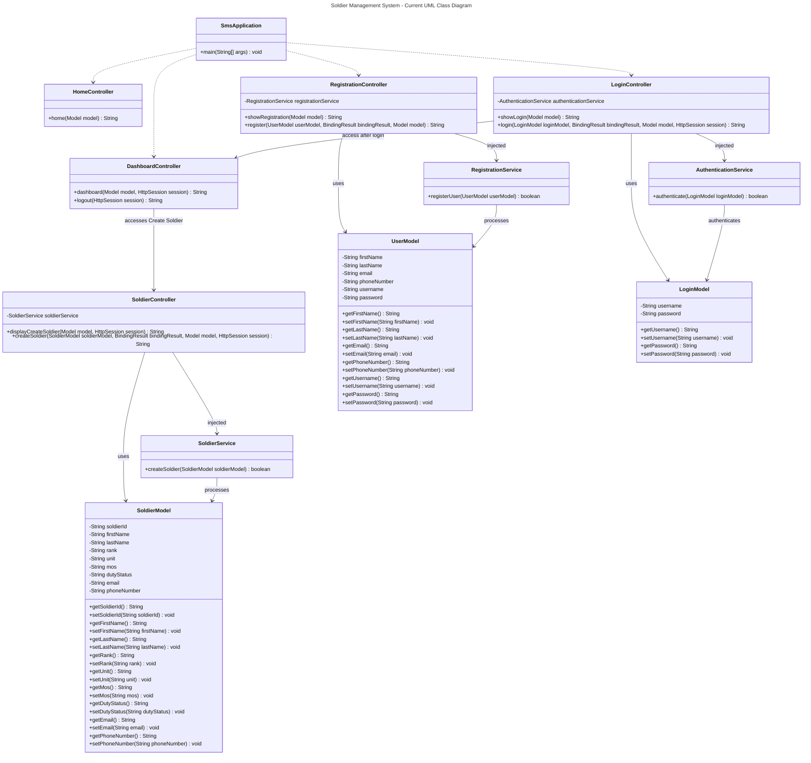

# Milestone 3

- Author: John Dearing
- Date: 09/27/2026

## Introduction

- This is **Milestone 3:**

- In Milestone 3, I enhanced the Soldier Management System by introducing Spring Beans, Spring Core, and Dependency Injection in the business services of the application. The Login and Registration modules were rewritten such that the business logic resides in Spring service classes rather than in the controllers themselves. I added the Product Creation milestone feature as a Create Soldier module since the Soldier is the main business entity in the Soldier Management System. For the implementation of the Create Soldier feature, Spring MVC, Thymeleaf form binding, Jakarta Bean Validation, the @Valid annotation, and BindingResult have been used for validation. The Create Soldier view can be accessed from the Dashboard view once the user logs in successfully. The database is not needed for Milestone 3; therefore, the authentication, registration, and creation of Soldiers are done in a simulation mode at the moment without any persistence. The current application theme, Bootstrap responsive design, custom CSS, and Thymeleaf layouts have been used in the application.

## Tasks Completed

1. Finalized the Soldier Management System application theme, including colors, fonts, page layouts, navigation, and responsive styling.

2. Maintained the Home, Registration, Login, and Dashboard pages using Spring MVC and Thymeleaf.

3. Maintained reusable header and footer fragments using defaultTemplate.html.

4. Refactored the Login Module to use a Spring AuthenticationService business service.

5. Implemented constructor-based Dependency Injection between LoginController and AuthenticationService.

6. Refactored the Registration Module to use a Spring RegistrationService business service.

7. Implemented constructor-based Dependency Injection between RegistrationController and RegistrationService.

8. Created SoldierModel as the product object model for the Soldier Management System.

9. Created SoldierService as a Spring business service for Soldier operations.

10. Created SoldierController using Spring MVC and constructor-based Dependency Injection.

11. Created the Create Soldier page using Thymeleaf, Bootstrap, and the application's existing theme.

12. Added Create Soldier functionality to the Dashboard so the page can be accessed after login.

13. Implemented Jakarta Bean Validation for the Soldier creation form.

14. Added validation error messages to the Create Soldier page.

15. Added session checks to prevent unauthenticated users from accessing the Dashboard and Create Soldier functionality.

16. Designed the planned database structure and DDL for Soldier records for implementation during Milestone 4.

17. Updated the Current Architecture, Sitemap, and UML Class Diagram for Milestone 3.

18. Tested login, registration, Dashboard navigation, Soldier creation, validation errors, and application navigation.

## Planning Documentation

The Soldier Management System is still being developed in an incremental way according to the CST-339 milestones. In Milestone 3, the Spring MVC application created in Milestone 2 has been enhanced with Spring business services, Dependency Injection, and the application's first module to create business objects.

Controllers in the Login and Registration modules have been decoupled from business services in such a way that they only process HTTP requests whereas business services perform the actual application's business operation. The Create Soldier module introduces a new architectural pattern to be followed in creating modules related to Soldiers' management in future.

Data persistence will be implemented in Milestone 4. Soldier's database structure is going to be created in Milestone 3 so that in the next milestone, the application will be refactored to make use of persistent data.

Git will be used to track the source code changes. The Design Report will be updated as the application changes architecturally and functionally.

## General Technical Approach

Soldier Management System is a Java web application built on Spring Boot and Spring MVC framework.

The application implements the Model-View-Controller (MVC) design pattern to separate application presentation, models, and controllers.

Thymeleaf framework is used to implement HTML template, reusable page component, and form binding. Bootstrap and custom CSS are used to implement the application UI and responsiveness.

In milestone 3, a business service layer has been added using Spring Beans and dependency injection. The Spring-managed business services include AuthenticationService, RegistrationService, and SoldierService. These business services are injected to their respective controllers using constructor based dependency injection.

Soldier is the product object in Soldier Management System. The process of creating soldiers involves the use of SoldierModel, SoldierController, SoldierService, and Create Soldier Thymeleaf page.

Persistence through database is not implemented in milestone 3. It will be implemented in milestone 4.

## Key Technical Decisions

- Java and Spring Boot are used as the primary application platform.

- Spring MVC is used to implement the Model-View-Controller architecture.

- Thymeleaf is used for HTML templates and form binding.

- Bootstrap and custom CSS are used for responsive design and the application theme.

- Common Thymeleaf fragments are used for the application header and footer.

- Spring @Service components are used to implement the business service layer.

- Constructor-based Dependency Injection is used to provide business services to Spring MVC controllers.

- AuthenticationService handles simulated authentication business logic.

- RegistrationService handles simulated registration business logic.

- SoldierService handles Soldier creation business logic.

- SoldierModel represents the product object required by Milestone 3.

- Jakarta Bean Validation is used to validate user and Soldier information.

- @Valid and BindingResult are used by controllers to process validation results.

- HttpSession is used to maintain the simulated logged-in state.

- Create Soldier is accessed from the Dashboard after a successful login.

- Database persistence is intentionally deferred until Milestone 4.

## Install or Configuration Instructions

1. Install Java 17 or later.

2. Install Visual Studio Code.

3. Install the required Java and Spring Boot extensions for Visual Studio Code.

4. Install Maven if it is not already available.

5. Clone or download the CST-339 repository.

6. Open the Milestone 3 SMS project directory in Visual Studio Code.

7. Open a terminal in the SMS project directory.

8. Clean and compile the application using:

```bash
mvn clean compile
```

9. Build the application using:

```bash
mvn clean install
```

10. Start the application using:

```bash
mvn spring-boot:run
```

11. Open a browser and navigate to:

```text
http://localhost:8080/
```

12. Register a test user or navigate to the Login page.

13. Enter valid test login information.

14. After login, use the Dashboard to access the Create Soldier page.

## Known Issues

- Registration information is not currently saved to a database.

- Login authentication is simulated for Milestone 3.

- Created Soldier information is not currently saved to a database.

- Application data will be lost because persistence has not yet been implemented.

- Forgot Username and Forgot Password functionality has not yet been implemented.

- Formation Level Access and View My Soldier Data are currently Dashboard options, but their complete functionality will be implemented during later milestones.

- Session checks provide temporary access control for Milestone 3 but are not a replacement for Spring Security.

- Full authentication and authorization will be implemented during the later security milestone.

## Current Architecture



## Current Sitemap



## Current UML Class Diagram



## Planned DDL Scripts

The following DDL represents the planned database design. The database is not implemented during Milestone 3 and is planned for Milestone 4.

```sql
CREATE TABLE formations (
    formation_id BIGINT AUTO_INCREMENT PRIMARY KEY,
    formation_name VARCHAR(100) NOT NULL,
    unit_type VARCHAR(50) NOT NULL,
    location VARCHAR(100)
);
```
```sql
CREATE TABLE users (
    user_id BIGINT AUTO_INCREMENT PRIMARY KEY,
    first_name VARCHAR(30) NOT NULL,
    last_name VARCHAR(30) NOT NULL,
    email VARCHAR(100) NOT NULL,
    phone_number VARCHAR(20) NOT NULL,
    username VARCHAR(32) NOT NULL UNIQUE,
    password VARCHAR(255) NOT NULL,
    role VARCHAR(30),
    formation_id BIGINT,

    CONSTRAINT fk_user_formation
        FOREIGN KEY (formation_id)
        REFERENCES formations(formation_id)
);
```
```sql
CREATE TABLE soldiers (
    soldier_id VARCHAR(20) PRIMARY KEY,
    first_name VARCHAR(30) NOT NULL,
    last_name VARCHAR(30) NOT NULL,
    rank VARCHAR(20) NOT NULL,
    unit VARCHAR(100) NOT NULL,
    mos VARCHAR(10) NOT NULL,
    duty_status VARCHAR(30) NOT NULL,
    email VARCHAR(100) NOT NULL,
    phone_number VARCHAR(20) NOT NULL,
    formation_id BIGINT,

    CONSTRAINT fk_soldier_formation
        FOREIGN KEY (formation_id)
        REFERENCES formations(formation_id)
);
```

## Code Review and Documentation

The source code for milestone 3 was evaluated based on organization, names, validation, Spring MVC design, Dependency Injection, and separation of concerns between controllers and business service.

Since this project is being done individually, the code review will be done individually unless peer review is required from the instructor. Documentation of classes and methods will be through the use of JavaDoc comments and inline comments where necessary to explain the application logic.

## Milestone 3 Testing

The following functionality was tested:

1. Home page loads successfully.
2. Registration page loads successfully.
3. Invalid registration information displays validation errors.
4. Valid registration information is accepted without database persistence.
5. Login page loads successfully.
6. Invalid login information displays validation errors.
7. Valid simulated login redirects the user to the Dashboard.
8. The Dashboard is available after successful login.
9. Create Soldier is accessible from the Dashboard.
10. Direct access to Create Soldier without a login session redirects to Login.
11. Empty or invalid Soldier information displays validation errors.
12. Valid Soldier information produces a successful creation message without database persistence.
13. Logout invalidates the current session and returns the user to the Home page.
14. Application pages maintain the common theme and responsive layout.

## Screenshots

- Dashboard page:


- Create Soldier page:


- Create Soldier page Error:


## Links

- [John Dearing CST339 Repository](https://github.com/DragonReborn10/cst339/tree/main)
- [Grand Canyon University](https://www.gcu.edu/)
