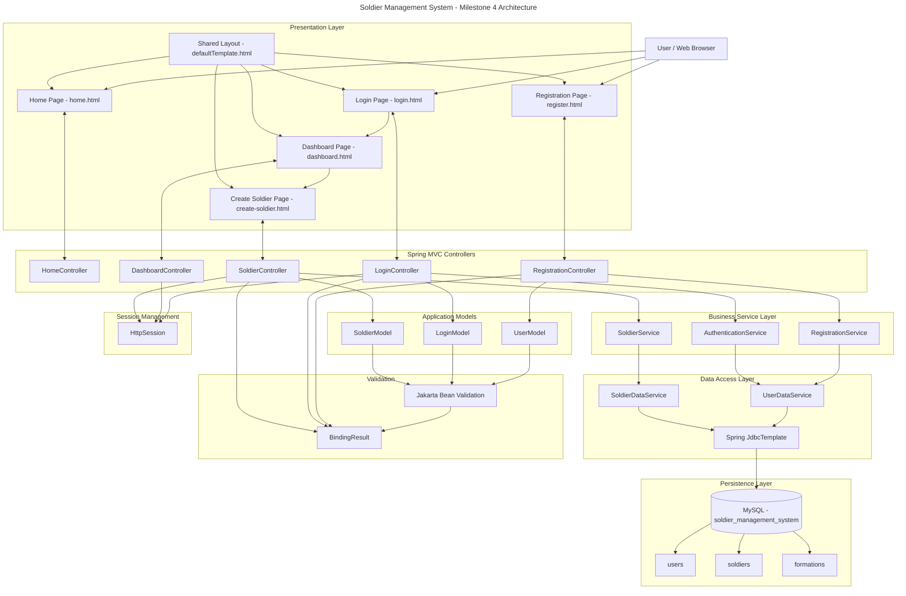
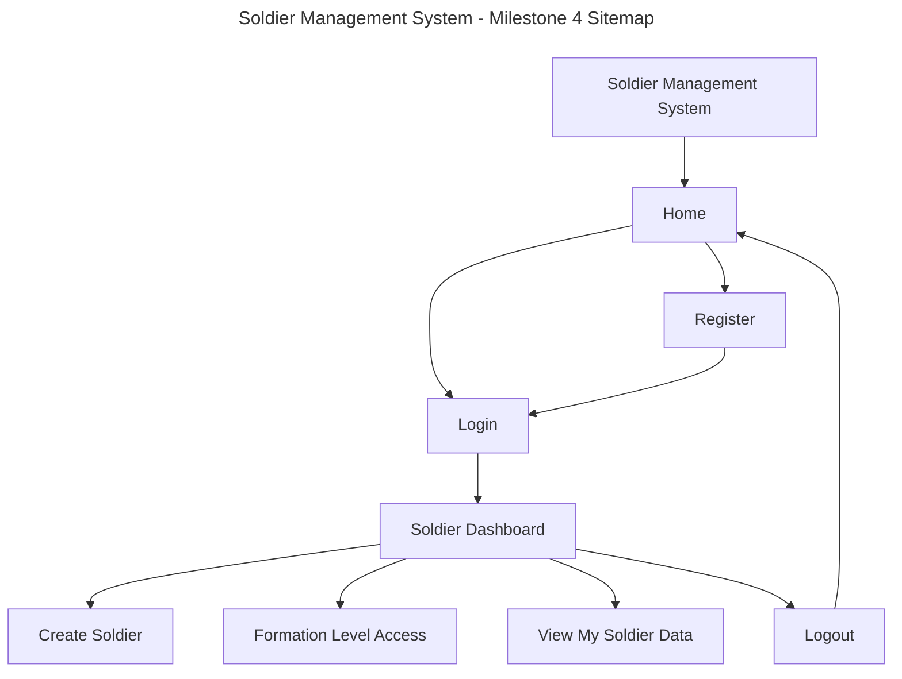
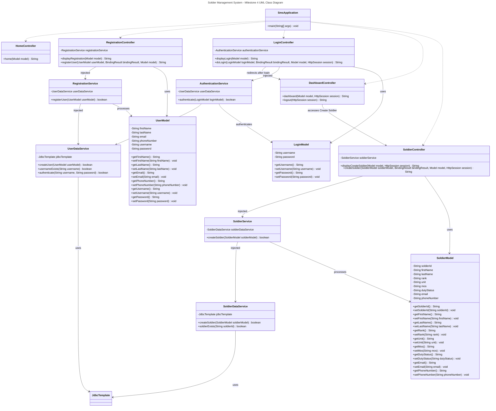

# Milestone 4 Project Design

- Author: John Dearing
- Date: 10/04/2026

## Install / Configuration Instructions

1. Install Java 17 or later.

2. Install Visual Studio Code.

3. Install the required Java and Spring Boot extensions for Visual Studio Code.

4. Clone or download the CST-339 repository.

5. Open the Milestone 4 SMS project directory in Visual Studio Code.

6. Start MAMP.

7. Start the MySQL server in MAMP.

8. Verify that MySQL is running on port `3306`.

9. Create the `soldier_management_system` database and required tables using the DDL included in this report.

10. Configure `src/main/resources/application.properties`:

```properties
spring.application.name=sms

spring.datasource.url=jdbc:mysql://localhost:3306/soldier_management_system
spring.datasource.username=${DB_USERNAME:root}
spring.datasource.password=${DB_PASSWORD:root}
spring.datasource.driver-class-name=com.mysql.cj.jdbc.Driver
```

11. Open a terminal in the SMS Maven project directory.

12. Clean and compile the application using the Maven Wrapper:

```powershell
.\mvnw.cmd clean compile
```

13. Start the application during development using:

```powershell
.\mvnw.cmd spring-boot:run
```

14. Open a browser and navigate to:

```text
http://localhost:8080/
```

15. Register a fictional test user.

16. Verify that the registered user appears in the MySQL `users` table.

17. Log in using the registered test account.

18. Navigate to the Dashboard.

19. Select Create Soldier.

20. Enter fictional Soldier information and submit the form.

21. Verify that the Soldier appears in the MySQL `soldiers` table.

22. Stop the application and create the executable JAR using:

```powershell
.\mvnw.cmd clean package
```

23. Run the packaged application outside Visual Studio Code using:

```powershell
java -jar .\target\sms-0.0.1-SNAPSHOT.jar
```

24. Navigate to `http://localhost:8080/` and verify that the packaged application operates correctly.

## Current Architecture



---

## Current Sitemap



## Current UML Class Diagram



The `FORMATIONS` table provides the relational structure required for future formation-level functionality. One formation can be associated with multiple users and multiple Soldiers.

The current Create Soldier workflow stores the Soldier's entered Unit directly in `soldiers.unit`. Although `formation_id` exists in the relational design, the current application does not yet assign this value through the Create Soldier form.

## DDL Scripts

The following DDL represents the database implemented for Milestone 4.

```sql
CREATE DATABASE IF NOT EXISTS soldier_management_system;

USE soldier_management_system;


CREATE TABLE formations (

    formation_id BIGINT AUTO_INCREMENT PRIMARY KEY,

    formation_name VARCHAR(100) NOT NULL,

    unit_type VARCHAR(50) NOT NULL,

    location VARCHAR(100)

);


CREATE TABLE users (

    user_id BIGINT AUTO_INCREMENT PRIMARY KEY,

    first_name VARCHAR(30) NOT NULL,

    last_name VARCHAR(30) NOT NULL,

    email VARCHAR(100) NOT NULL,

    phone_number VARCHAR(20) NOT NULL,

    username VARCHAR(32) NOT NULL UNIQUE,

    password VARCHAR(255) NOT NULL,

    role VARCHAR(30) NOT NULL DEFAULT 'USER',

    formation_id BIGINT,

    CONSTRAINT fk_users_formation
        FOREIGN KEY (formation_id)
        REFERENCES formations(formation_id)

);


CREATE TABLE soldiers (

    soldier_id VARCHAR(20) PRIMARY KEY,

    first_name VARCHAR(30) NOT NULL,

    last_name VARCHAR(30) NOT NULL,

    `rank` VARCHAR(20) NOT NULL,

    unit VARCHAR(100) NOT NULL,

    mos VARCHAR(10) NOT NULL,

    duty_status VARCHAR(30) NOT NULL,

    email VARCHAR(100) NOT NULL,

    phone_number VARCHAR(20) NOT NULL,

    formation_id BIGINT,

    CONSTRAINT fk_soldiers_formation
        FOREIGN KEY (formation_id)
        REFERENCES formations(formation_id)

);
```

## Links

- [John Dearing CST339 Repository](https://github.com/DragonReborn10/cst339/tree/main)
- [Grand Canyon University](https://www.gcu.edu/)
- [Milestone4 README.md](https://github.com/DragonReborn10/cst339/blob/main/milestones/milestone4/README.md)
- [Milestone4 analysisPlanning.md](https://github.com/DragonReborn10/cst339/blob/main/milestones/milestone4/analysisPlanning.md)
- [Milestone4 projectStatus.md](https://github.com/DragonReborn10/cst339/blob/main/milestones/milestone4/projectStatus.md)
- [Milestone4 test.md](https://github.com/DragonReborn10/cst339/blob/main/milestones/milestone4/test.md)