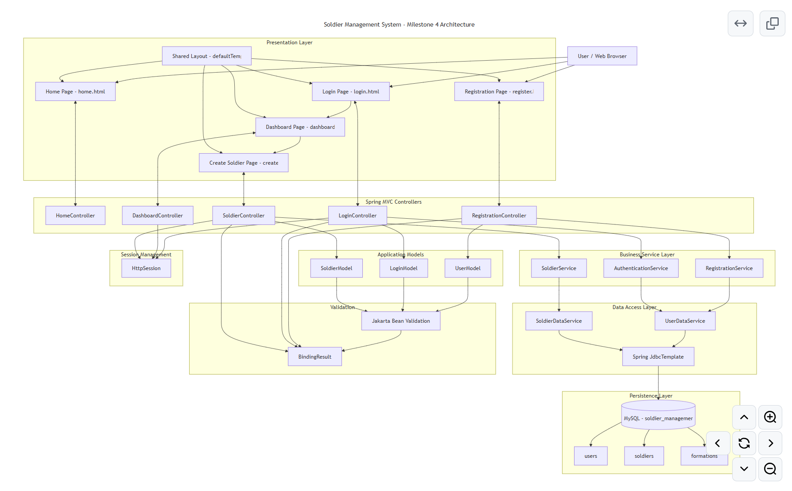
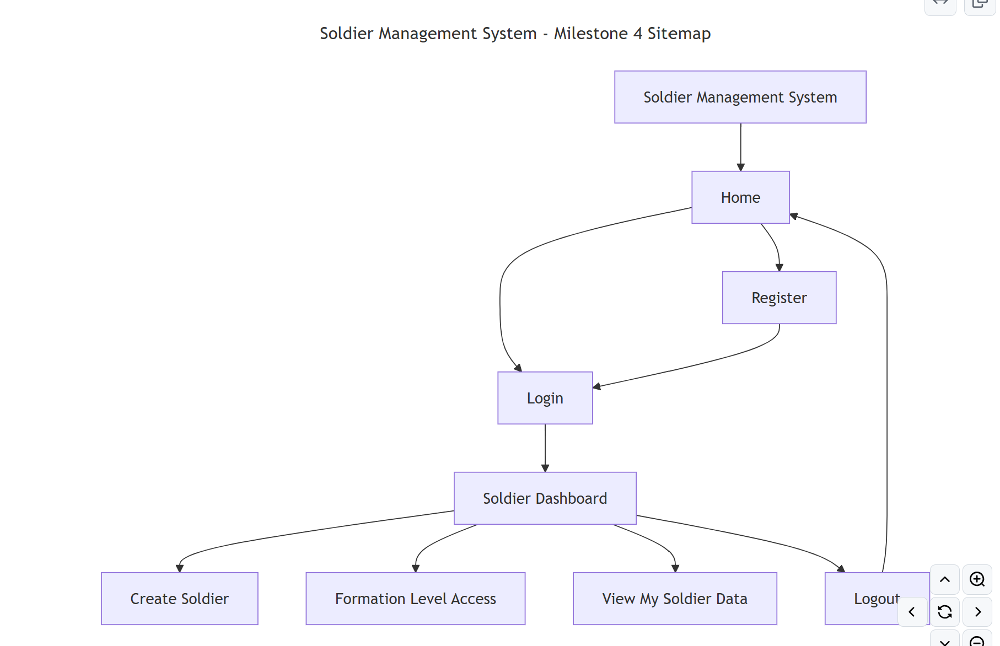
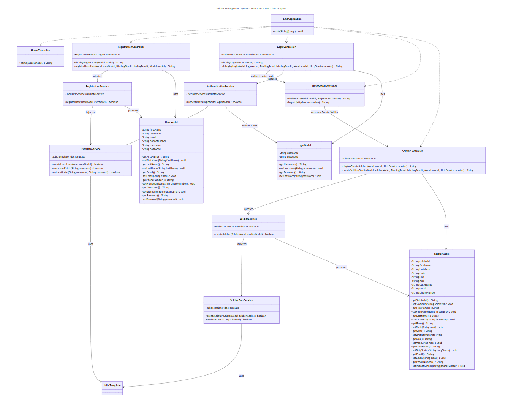
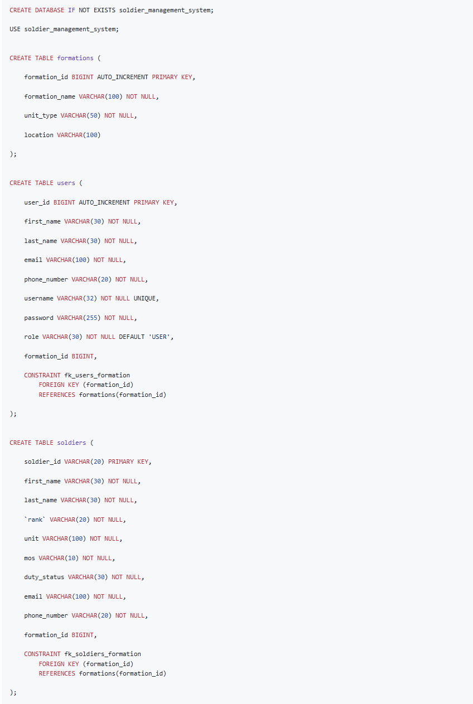

# Milestone 4 Project Design

- Author: John Dearing
- Date: 10/04/2026

## Install / Configuration Instructions

1. Install Java 17 or later.

2. Install Visual Studio Code.

3. Install the required Java and Spring Boot extensions for Visual Studio Code.

4. Clone or download the CST-339 repository.

5. Open the Milestone 4 SMS project directory in Visual Studio Code.

6. Start MAMP.

7. Start the MySQL server in MAMP.

8. Verify that MySQL is running on port `3306`.

9. Create the `soldier_management_system` database and required tables using the DDL included in this report.

10. Configure `src/main/resources/application.properties`:

```properties
spring.application.name=sms

spring.datasource.url=jdbc:mysql://localhost:3306/soldier_management_system
spring.datasource.username=${DB_USERNAME:root}
spring.datasource.password=${DB_PASSWORD:root}
spring.datasource.driver-class-name=com.mysql.cj.jdbc.Driver
```

11. Open a terminal in the SMS Maven project directory.

12. Clean and compile the application using the Maven Wrapper:

```powershell
.\mvnw.cmd clean compile
```

13. Start the application during development using:

```powershell
.\mvnw.cmd spring-boot:run
```

14. Open a browser and navigate to:

```text
http://localhost:8080/
```

15. Register a fictional test user.

16. Verify that the registered user appears in the MySQL `users` table.

17. Log in using the registered test account.

18. Navigate to the Dashboard.

19. Select Create Soldier.

20. Enter fictional Soldier information and submit the form.

21. Verify that the Soldier appears in the MySQL `soldiers` table.

22. Stop the application and create the executable JAR using:

```powershell
.\mvnw.cmd clean package
```

23. Run the packaged application outside Visual Studio Code using:

```powershell
java -jar .\target\sms-0.0.1-SNAPSHOT.jar
```

24. Navigate to `http://localhost:8080/` and verify that the packaged application operates correctly.

## Diagrams and DDL Scripts

| Page Name | Description | Image |
| --- | --- | --- |
| Current Architecture | Shows the Milestone 4 N-Layer architecture of the Soldier Management System, including the presentation, controller, business service, data access, model, validation, session management, and MySQL persistence layers. | [](imgs/Architecture.png) |
| Current Sitemap | Shows the current navigation flow of the Soldier Management System from the Home page through Registration, Login, Dashboard, Create Soldier, Formation Level Access, View My Soldier Data, and Logout. | [](imgs/Sitemap.png) |
| UML Class Diagram | Shows the current Java classes and relationships between controllers, business services, data services, models, and Spring JdbcTemplate. It also shows constructor-based dependency injection and the database access relationships added in Milestone 4. | [](imgs/ClassDiagram.png) |
| DDL Scripts | Shows the Milestone 4 MySQL DDL used to create the `soldier_management_system` database and the `formations`, `users`, and `soldiers` tables, including primary keys, unique constraints, and foreign key relationships. | [](imgs/DDLScripts.png) |

## Links

- [John Dearing CST339 Repository](https://github.com/DragonReborn10/cst339/tree/main)
- [Grand Canyon University](https://www.gcu.edu/)
- [Milestone4 README.md](https://github.com/DragonReborn10/cst339/blob/main/milestones/milestone4/README.md)
- [Milestone4 analysisPlanning.md](https://github.com/DragonReborn10/cst339/blob/main/milestones/milestone4/analysisPlanning.md)
- [Milestone4 projectStatus.md](https://github.com/DragonReborn10/cst339/blob/main/milestones/milestone4/projectStatus.md)
- [Milestone4 test.md](https://github.com/DragonReborn10/cst339/blob/main/milestones/milestone4/test.md)